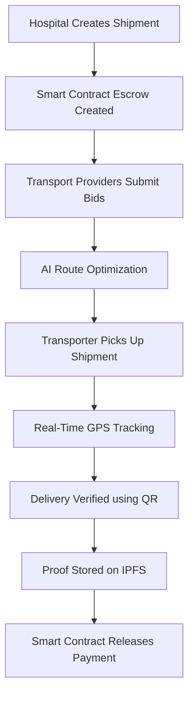
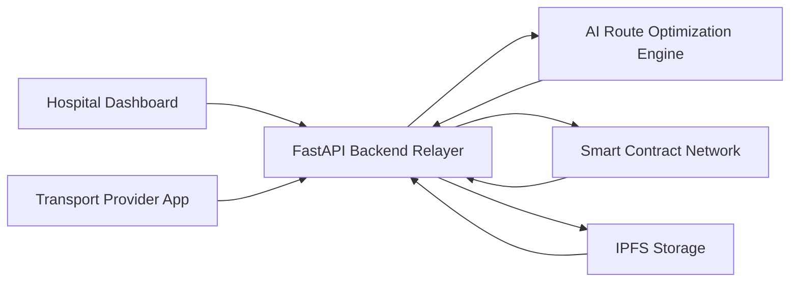

# 🌍 Overview

**ChainRX** is a decentralized healthcare logistics platform designed to ensure **secure, transparent, and efficient transportation of medical resources** including vaccines, medicines, diagnostic samples, and blood units.

The platform combines **blockchain smart contracts, AI logistics intelligence, real-time shipment tracking, and decentralized governance** to build a trustless healthcare supply chain network.

ChainRX ensures:

- secure transport coordination  
- immutable logistics records  
- automated escrow payments  
- transparent delivery verification  

---

# 🚀 Core Features

| Feature | Description |
|------|-------------|
| 🔐 Smart Contract Escrow | Funds locked and released automatically after delivery confirmation |
| 📲 QR Handshake | Secure pickup and delivery verification |
| 🛰 Real-Time GPS Tracking | Monitor shipments live |
| 🤖 AI Route Intelligence | Genetic Algorithm for optimal transport routes |
| 🗳 DAO Governance | Community voting for platform improvements |
| 📸 IPFS Proof-of-Delivery | Immutable delivery evidence |
| 👥 Role-Based Access | Separate dashboards for hospitals and transporters |

---

## 🔄 Logistics Workflow

---

#  AI Logistics Intelligence

ChainRX integrates **AI-based route optimization** using a **Genetic Algorithm that solves the Travelling Salesman Problem (TSP)**.

The AI engine evaluates logistics data to determine the most efficient delivery route for medical shipments.

### Decision Factors

| Parameter | Purpose |
|-----------|--------|
| Distance | Determines the shortest possible delivery path |
| Traffic Conditions | Helps avoid congestion and delays |
| Delivery Deadline | Ensures time-critical medical supplies arrive on schedule |
| Multi-Drop Locations | Optimizes routes with multiple delivery points |

### Benefits

- Faster delivery of critical medical resources  
- Reduced transportation costs  
- Improved route efficiency  
- Better emergency response logistics  

---

## 🏗 System Architecture

---

## 🖼 User Interface

### 📱 Hospital Dashboard

Hospitals can:

- create shipment requests
- track deliveries in real time
- verify proof-of-delivery
- participate in DAO governance
- 
### 🚚 Transporter Dashboard

Transport providers use the transporter dashboard to manage logistics operations.

Transporters can:

- View available shipment requests  
- Accept transport assignments  
- Follow optimized routes suggested by the AI engine  
- Confirm pickup and delivery using QR verification  

---

## 🛰 Real-Time Tracking

ChainRX enables **live monitoring of medical shipments** throughout the transport lifecycle.

Key tracking capabilities include:

- Vehicle GPS location tracking  
- Shipment route visualization  
- Delivery progress updates  
- Real-time status notifications for hospitals and transport providers  

---

## 🛠 Technology Stack

| Layer | Technologies |
|------|-------------|
| Mobile | Kotlin, Android SDK |
| Backend | FastAPI, Web3.py |
| Blockchain | Solidity, Hardhat |
| Network | Polygon / Shardeum |
| Storage | IPFS, Pinata |
| Tracking | WebSockets, OpenStreetMap |

---

## 📁 Project Structure

The **ChainRX** platform follows a modular architecture that separates the **mobile application, backend services, and blockchain layer**.  
This structure ensures **scalability, maintainability, and efficient collaboration** during development.

---

### 🗂 Directory Overview

---

## 📱 app/ – Android Application

The **`app/`** directory contains the **Android mobile application developed using Kotlin and Android SDK**.

This application serves as the **primary user interface** for hospitals, transport providers, and drivers to interact with the ChainRX logistics platform.

### ✨ Key Features

- 📦 **Shipment Creation** – Hospitals can create requests for medical resource transport.
- 🚚 **Delivery Assignment** – Transport providers can accept logistics tasks.
- 🛰 **Real-Time Tracking** – Monitor shipment location using GPS tracking.
- 🔐 **QR Code Verification** – Secure pickup and delivery confirmation.
- 🌡 **IoT Monitoring** – View temperature and shipment sensor alerts.

The mobile application communicates with the backend using **REST APIs** and receives **real-time updates via WebSocket connections**.

---

## ⚙ Backend/ – FastAPI Relayer Server

The **`Backend/`** directory contains the **server-side logic implemented using FastAPI (Python)**.

It acts as the **central communication hub** between the mobile application, blockchain network, and IoT monitoring system.

### 🧠 Core Responsibilities

- 📡 Handling API requests from the mobile application
- 📦 Managing shipment and logistics data
- 🔗 Interacting with blockchain smart contracts using **Web3.py**
- 🌡 Processing **IoT sensor data** from logistics containers
- 📸 Uploading **proof-of-delivery images to IPFS**
- 🗄 Managing data storage using **PostgreSQL (NeonDB)**

### 🔁 Relayer Pattern

The backend implements a **Relayer Pattern**, which allows the server to:

- sign blockchain transactions on behalf of users
- manage gas fees
- simplify the blockchain interaction process for mobile users

This ensures a **seamless Web3 experience without requiring users to manage wallets directly**.

---

## 🔗 Blockchain/ – Smart Contracts

The **`Blockchain/`** directory contains the **Solidity smart contracts** responsible for implementing the decentralized logistics logic.

These contracts guarantee **transparency, automation, and trustless execution** within the ChainRX system.

### ⛓ Smart Contract Functions

- 📦 **Shipment Creation & Tracking**
- 💰 **Escrow-Based Payments**
- ✅ **Delivery Confirmation**
- 📜 **Immutable Blockchain Event Logging**
- 🗳 **DAO Governance Mechanisms**

The contracts are compiled and deployed using **Hardhat** and deployed on a blockchain test network such as:

- Polygon Testnet
- Shardeum Network

## 📜 Smart Contracts

| Contract | Address | Network |
|---------|--------|--------|
| Shipment Contract | 0x3ce4d1cFB16C3B50eaa594B20b13AA28729E671b | Shardeum |
| DAO Contract | 0xB8a97FFfaF22D16f01b96d8BE7b1Aa5441608e1A | Shardeum |

---

## 🌍 Real-World Impact

ChainRX aims to improve global healthcare logistics by enabling:

- Secure vaccine distribution  
- Transparent medical supply chains  
- Faster emergency deliveries  
- Reduced logistics disputes  

By integrating blockchain, AI, and decentralized storage, ChainRX creates a **trustworthy logistics infrastructure for healthcare systems**.

---

## 🔮 Future Roadmap

| Feature | Description |
|-------|-------------|
| Drone Delivery | Autonomous medical transport systems |
| IoT Containers | Temperature and humidity monitoring for cold-chain logistics |
| Predictive AI | Delivery risk prediction and route optimization |
| Logistics Tokens | Incentives for reliable transport providers |

---

## 🤝 Contributors

Developed as part of the **Glitchcon 2.0 Hackathon** to explore how blockchain and AI can improve healthcare logistics.

---

## ⚖ License

MIT License

---

---

